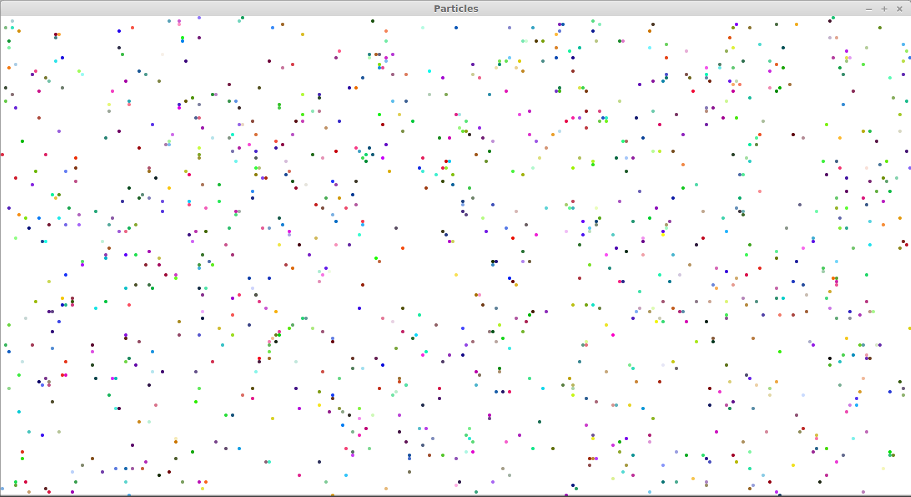
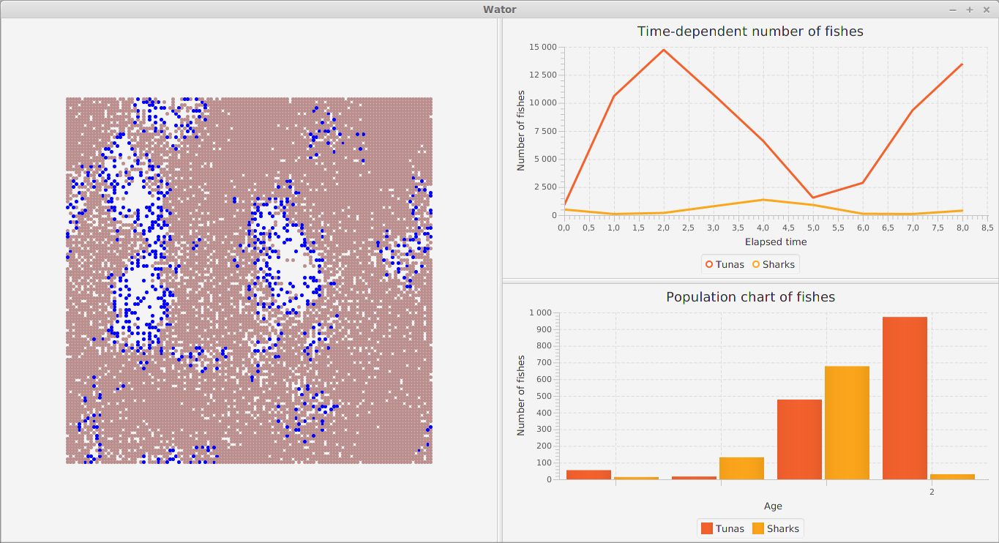
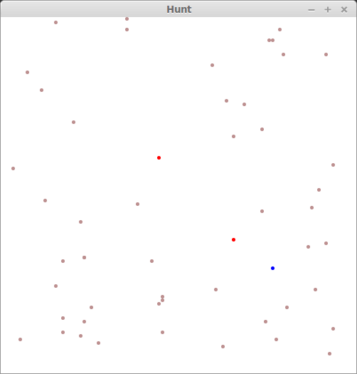

[](https://www.codacy.com/app/sallareznov/scalagent)

# scalagent
Behaviour simulation, Multi-agent system approach using Scala/FX

Full report at : https://github.com/sallareznov/scalagent/tree/master/report.pdf


### Compilation

To compile the project, use the command sbt assembly. This will generate an
executable archive named `scalagent.jar` in the folder `target/scala-2.11/`

For example, if the user wants to launch the hunt application with default parameters, the
command to enter is the following:
```
$ java -jar target/scala-2.11/scalagent.jar hunt
```

If the user wants to use the particles applications with a toroidal grid of 15000 particles,
the command to enter is the following:
```
$ java -jar target/scala-2.11/scalagent.jar particles --nbParticles=15000 --toroidal=true
```

PS: For the wator application, the time-dependent number of tunas and sharks and the age
pyramid are drawn in real time, during the execution of the application.

### Screenshots

#### Particles



#### Wator



#### Hunt




### UML


